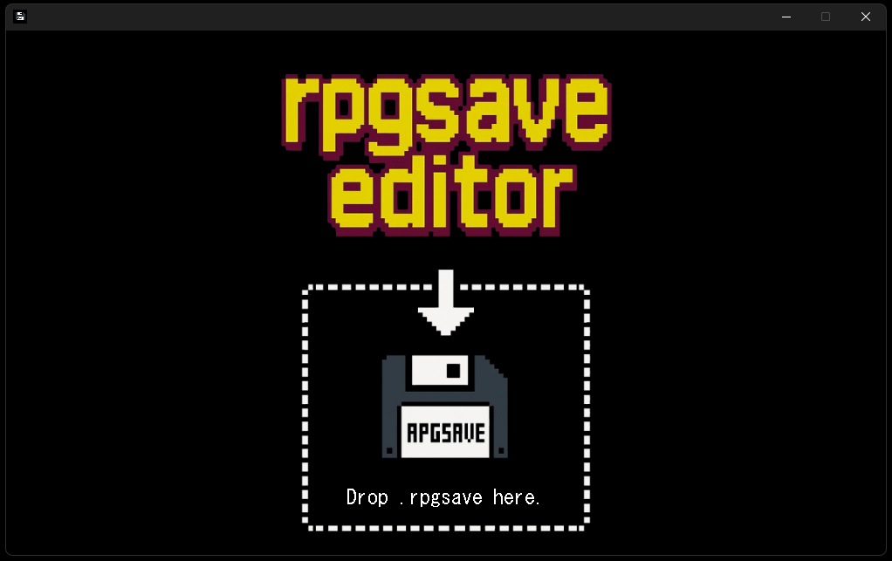
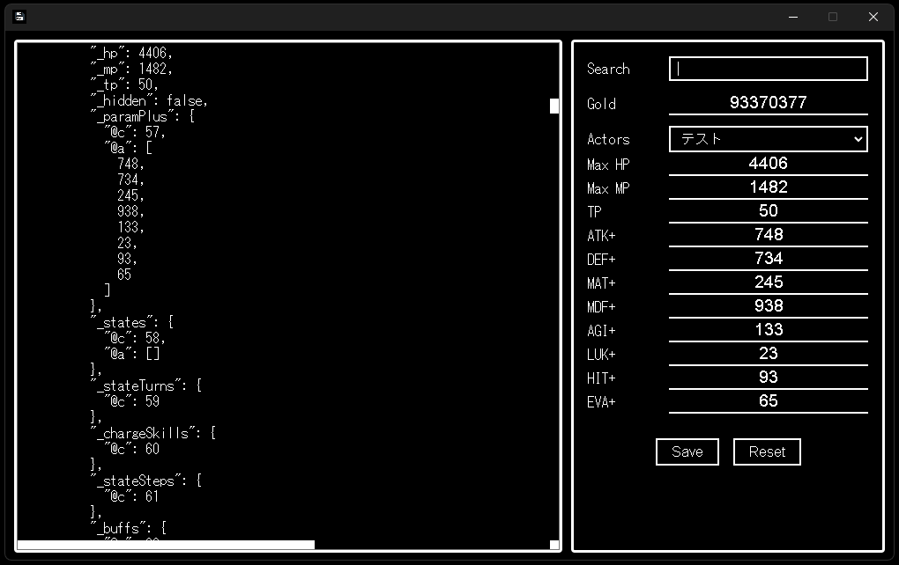

## 🧾 Overview

**RPGSave Editor** is a desktop application for editing save files (`.rpgsave`) used in RPG Maker MV.

You can load a `.rpgsave` file and intuitively edit values such as gold and character parameters through a GUI.  
After editing, you can re-save the file in its original `.rpgsave` format.

## 🖼 Screenshots

### 🔸 Start Screen

The initial screen when the app starts.  
Drag and drop a `.rpgsave` file onto the drop zone at the bottom center to begin editing.

---

### 🔸 Save Data Editing Screen

The left pane displays the contents of the loaded save data, which can be edited directly.  
On the right, you can search, edit gold, and select characters (Actors) to edit each parameter.  
Clicking on a parameter label will automatically input the maximum value for that field.

## 💻 System Requirements

- Supported OS:

  - ✅ Windows 10 / 11 (64-bit)
  - ⚠️ macOS (planned support)
  - ❌ Linux (not supported)

- Supported Save File Format:

  - ✅ `.rpgsave` (RPG Maker MV only)
  - ❌ `.save` (RPG Maker MZ is not supported)

## 📦 Download & Launch

1. Download `rpgsave-editor-v1.1.0-win32-x64.zip` from the  
   [Releases page](https://github.com/takuyaihara/rpgsave-editor/releases)

2. Right-click the downloaded zip file and select “Extract All”.

3. Open the extracted folder and double-click `rpgsave-editor.exe` to launch.

4. Drag and drop a `.rpgsave` file onto the **drop zone at the bottom center** to enter the editing screen.

⚠️ On first launch, you may see a “Unknown publisher” warning from Windows SmartScreen.  
If so:

- Click “More info”
- Then click the “Run anyway” button

## 🧩 Main Features

- Load and parse `.rpgsave` save files
- Real-time editing in a text editor–like UI for JSON data
- Search function to jump and re-scan keywords
- Edit gold value
- Edit character (Actor) parameters: Level / EXP / HP / MP / TP / Stat bonuses
- Click parameter labels to auto-fill with the maximum value
- Save the modified data back to `.rpgsave` (compressed in LZ-String format)
- Reset button returns to the start screen

## ⚠️ Notes & Disclaimers

- This tool edits `.rpgsave` files and re-compresses them for saving.  
  You can overwrite or save as a new file freely.  
  ⚠️ Please make a backup of your original file before editing.

- Edited data may cause the game to behave unexpectedly.  
  Use this tool at your own risk.

- 🎯 This tool is primarily intended for **development support, debugging, and adjustment tasks**.  
  It can be useful for testing and balancing games during development.

- Editing parameters may allow changes beyond what the game originally intended.  
  It is recommended for use in **testing or development contexts only**.

## 📜 License

MIT License © 2025 [takuyaihara](https://github.com/takuyaihara)
