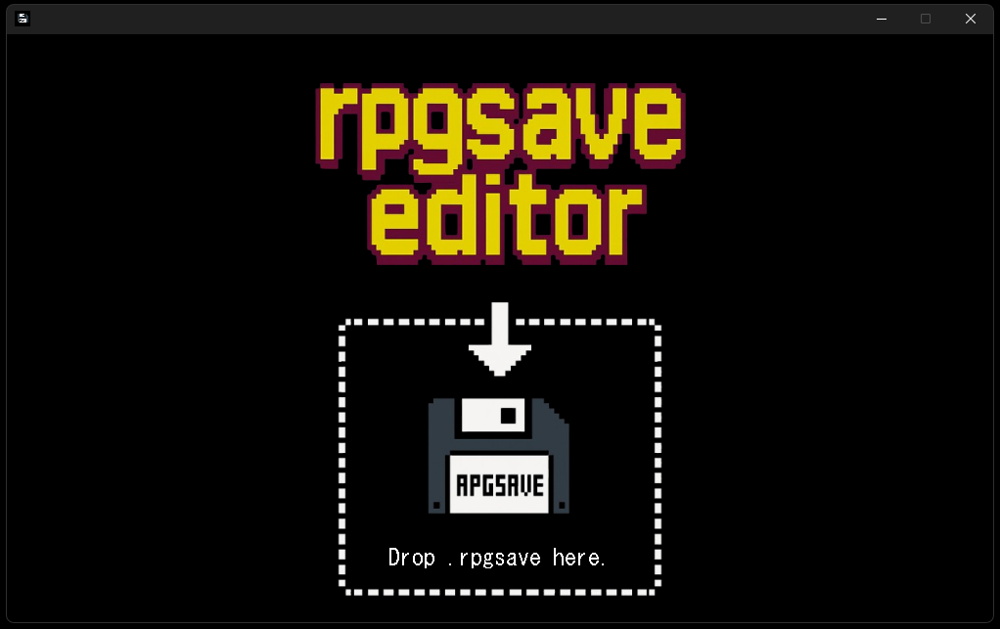
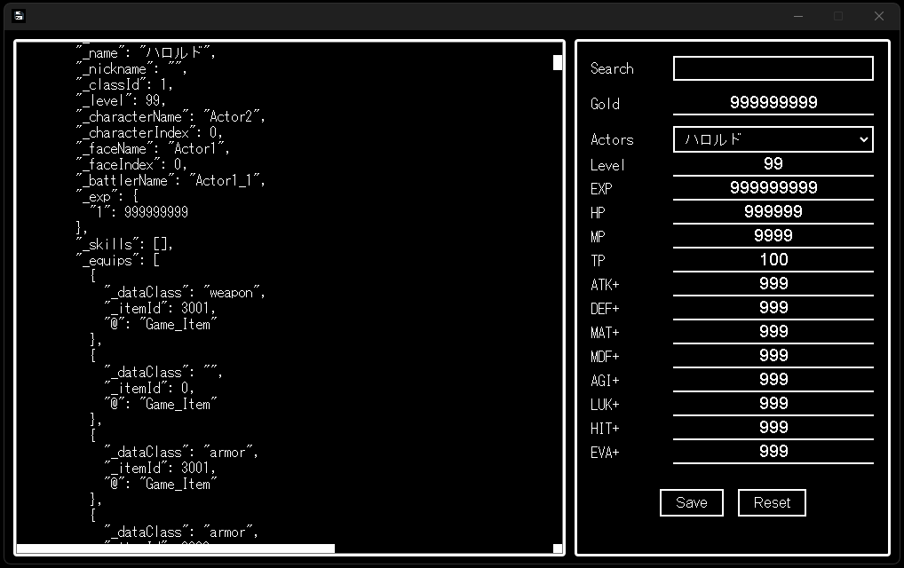

🌐 English version available: [README.en.md](./README.en.md)

## 🧾 概要（Overview）

**RPGSave Editor** は、  
RPGツクールMVのセーブデータ（`.rpgsave`）を編集できるデスクトップアプリです。

このツールは `.rpgsave` ファイルを読み取り、  
所持金や登場人物のパラメータなどを直感的にGUIで編集できます。

## 🖼 スクリーンショット

### 🔸 スタート画面

アプリ起動直後の画面。`.rpgsave` ファイルをドラッグ＆ドロップすると読み込みが始まります。

---

### 🔸 セーブデータ編集画面

読み込んだセーブデータの内容が左側に表示され、直接編集できます。  
右側では検索（Search）、所持金（Gold）変更、登場人物（Actors）を選択して各パラメータを編集できます。  
また、各パラメータ名（ラベル）をクリックすると、その項目の最大値が自動で入力されます。

## 💻 対応環境

- 対応OS：

  - ✅ Windows 10 / 11（64bit）
  - ⚠️ macOS（将来的に対応予定）
  - ❌ Linux（未定）

- 対応セーブデータ形式：

  - ✅ `.rpgsave`（RPGツクールMV 専用）
  - ❌ `.save`（RPGツクールMZ形式には対応していません）

## 📦 ダウンロードと起動方法

1. [リリースページ](https://github.com/takuyaihara/rpgsave-editor/releases) から  
   `rpgsave-editor-v1.1.0-win32-x64.zip` をダウンロードします。

2. ダウンロードした Zip を右クリックして「すべて展開」してください。

3. 展開したフォルダ内の `rpgsave-editor.exe` をダブルクリックで起動します。

4. `.rpgsave` ファイルを画面中央下のドロップゾーンにドラッグ＆ドロップすると、編集画面が表示されます。

⚠️ 初回起動時、Windows SmartScreen により「不明な発行元」と表示されることがあります。  
以下の手順で実行を続行してください：

- 「詳細情報」をクリック
- 「実行」ボタンを選択

## 🧩 主な機能

- `.rpgsave` セーブデータの読み込みと解析表示
- JSON形式の中身をテキストエディタ風UIでリアルタイム編集
- キーワード検索（Search）によるジャンプ・再検索
- 所持金（Gold）の編集
- 登場人物（Actors）の各パラメータ（Level / EXP / HP / MP / TP / 能力補正）編集
- 各パラメータラベルのクリックで最大値を自動入力
- Save ボタンで `.rpgsave` として再保存（LZ-String形式で再圧縮）
- Reset ボタンでスタート画面に戻る

## ⚠️ 使用上の注意

- このツールは `.rpgsave` セーブデータを編集し、**再圧縮して保存する形式**です。  
  保存時にはファイル名を自由に指定できるため、**上書き・別名保存のいずれにも対応**しています。  
  念のため、**元データのバックアップを取ることを推奨**します。

- 編集内容によっては、ゲームが正常に動作しなくなる可能性があります。  
  導入・使用は自己責任でお願いします。

- 🎯 **開発支援・デバッグ補助・調整作業** を目的としており、  
  制作中のゲームテストやバランス確認にもご活用いただけます。

- 登場人物のパラメータ編集などは、**ゲームの想定仕様を超えた調整**も可能です。  
  あくまで開発支援・テスト用途でのご利用を想定しています。

## 📜 ライセンス

MIT License © 2025 [takuyaihara](https://github.com/takuyaihara)
